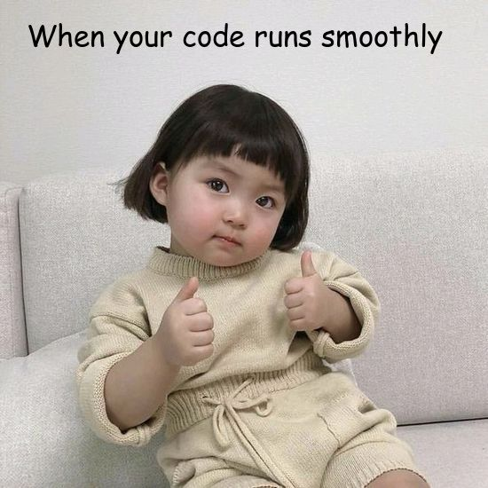

```{r setup, include=FALSE}
knitr::opts_chunk$set(echo = TRUE)
```

## Questions
<br>

#### Question-1: Local Variable Shadowing 

Create an R function that defines a global variable called `x` with a value of 5. Inside the function, declare a local variable also named `x` with a value of 10. Print the value of `x` both inside and outside the function to demonstrate shadowing.

**Solutions:**

```{r, eval=TRUE,echo=TRUE}
# Defining global variable
x <- 5
sprintf("Value of global variable x= %d", x)

# Declare a function, with local variable x = 10
local_variable <- function(){
  x <- 10
print(paste("Value of local variable x =", x))}
local_variable()


```
<br>

#### Question-2: Modify Global Variable

Create an R function that takes an argument and adds it to a global variable called `total`. Call the function multiple times with different arguments to accumulate the values in `total`.

**Solutions:**

```{r, eval=TRUE,echo=TRUE}
# Create a global variable 
total <- 0

# Creating a function
value_to_be_added <- function(value) {
  total <<- total + value # <<- to access 'total' as global variable within local 
}

# Calling function w diff arguments 
total <- value_to_be_added(3)
total <- value_to_be_added(90)
total <- value_to_be_added(7)

# Print accumulated values 
sprintf("Total accumulated values = %d", total)

```
<br>

#### Question-3: Global and Local Interaction 

Write an R program that includes a global variable `total` with an initial value of 100. Create a function that takes an argument, adds it to `total`, and returns the updated `total`. Demonstrate how this function interacts with the global variable.

**Solutions:**

```{r, eval=TRUE,echo=TRUE}
# Create Global variable 
total <- 100

sprintf("Inital total = %d", total)

# Creating a function
value_added <- function(number){
  updated_total = total + number
# Return updated 'total'
  return(updated_total)
}
#Adding to global variable
total <- value_added(10)
sprintf("Updated total value = %d", total)

```
<br>

#### Question-4: Nested Functions

Define a function `outer_function` that declares a local variable `x` with a value of 5. Inside `outer_function`, define another function `inner_function` that prints the value of `x`. Call both functions to show how the inner function accesses the variable from the outer function's scope.

**Solutions:**

```{r, eval=TRUE,echo=TRUE}
# Define outer_function that declares local variable x = 5
outer_function <- function(){
  x <- 5
  
  # Define inner function 
  inner_function <- function(){
    # Print value of x from outer function's scope
    sprintf("The value of x is %d", x)
  }
  
  # Call inner function
  inner_function()
}

#Call outer function
outer_function()

```
<br>

#### Question-5: Meme Generator Function

Create a function that takes a text input and generates a humorous meme with the text overlaid on an image of your choice. You can use the `magick` package for image manipulation. You can find more details about the commands offered by the package, with some examples of annotating images here: https://cran.r-project.org/web/packages/magick/vignettes/intro.html

**Solutions:**

```{r, eval=TRUE,echo=TRUE}

# Loading magick package
library(magick)

# Creating function
generate_meme <- function(input_text, input_image, output_image) {
  
  # Read image
  background <- image_read(input_image)
  
  # Annotate the image with the input text 
  image_with_text <- image_annotate(
    background,
    text = input_text,
    location = "+30+15", #Specify the x & y coordinates for text
    font = 'Comic Sans',
    size = 33,
    color = "black")
  
  # Save the resulting image
  image_write(image_with_text, output_image)
  
}

# Generate meme using function
generate_meme("When your code runs smoothly", "cute_baby.jpg", "baby_meme")

# Print the meme


```
<br>

#### Question-6: Text Analysis Game  

Develop a text analysis game in which the user inputs a sentence, and the R function provides statistics like the number of words, characters, and average word length. Reward the user with a "communication skill level" based on their input.

**Solutions:**

```{r, eval=TRUE,echo=TRUE}

# Creating a function to track statistics of sentence 

text_analysis_game <- function(){
  
  # Prompt user to input a sentence 
  user_input <- readline("Enter a sentence: ")
  
  # Calculate statistics
  word_count <- lengths(strsplit(user_input, ' '))
  char_count <- nchar(user_input)
  avg_word_length <- char_count/word_count
  
  # Determine communication skill level 
  skill_level = ifelse(avg_word_length < 4, "Basic", 
                       ifelse(avg_word_length < 6, "Intermediate", "Advance"))
  
  # Display statistics and skill level 
  print(paste0("Word count: ", word_count))
  print(paste0("Character count: ", char_count))
  print(paste0("Average word length: ", round(avg_word_length, 2)))
  print(paste0("Your communication skill level is: ", skill_level))
  
}

text_analysis_game()

```
<br>