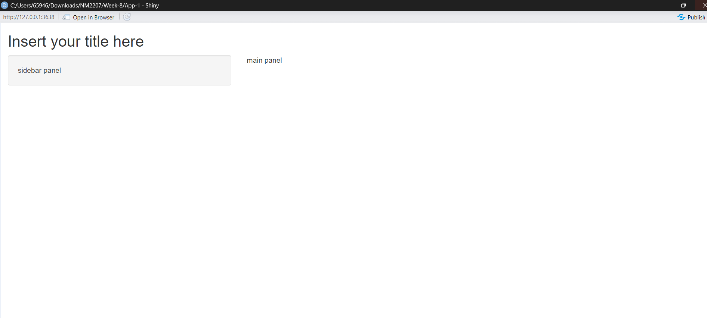
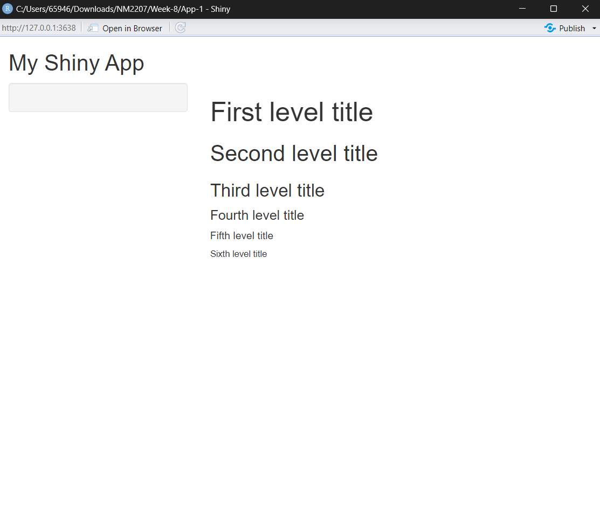
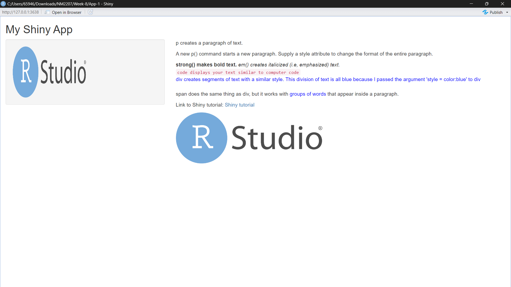
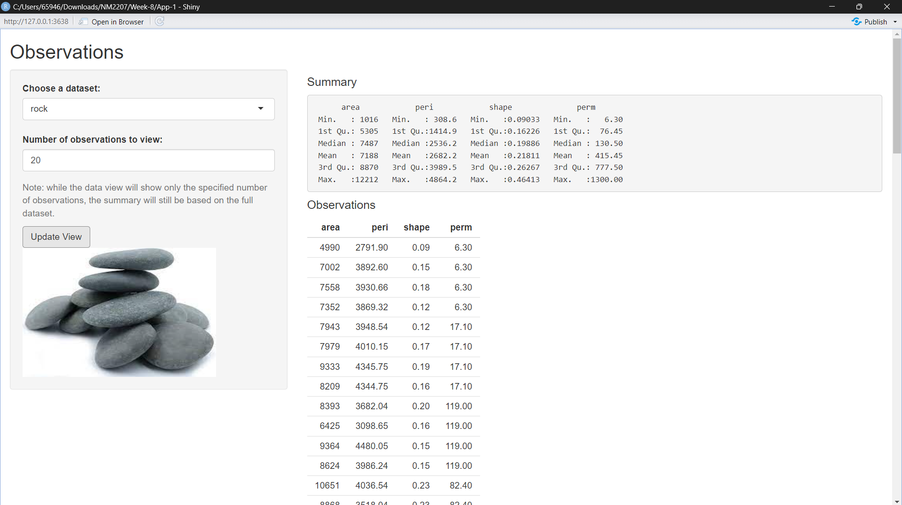
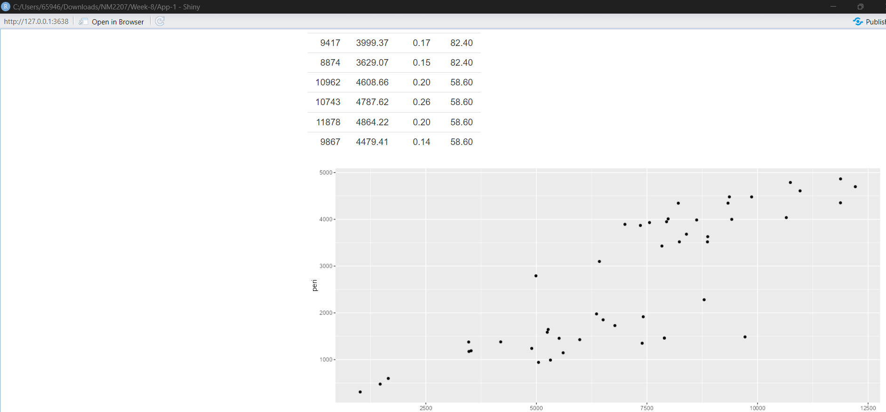
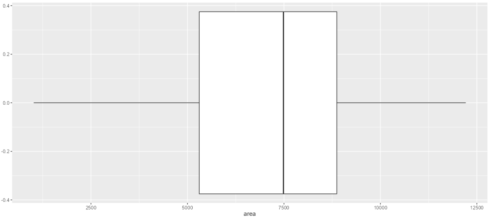
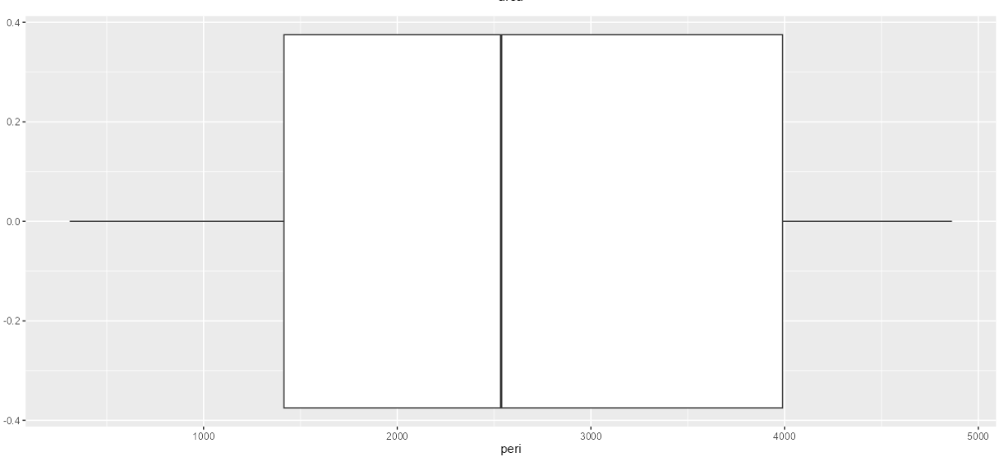
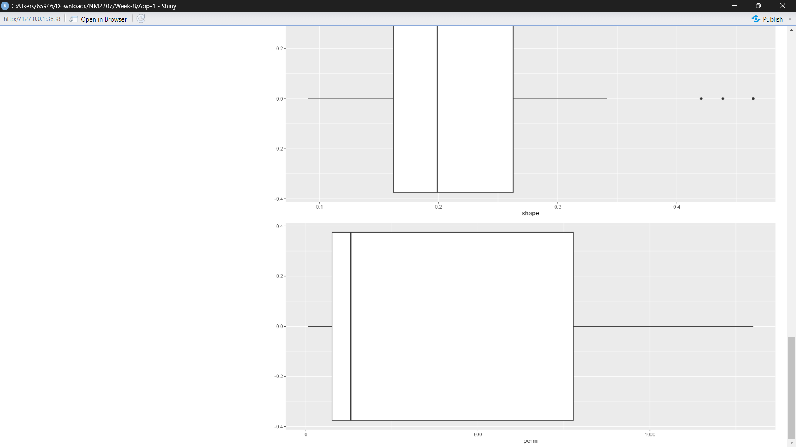

```{r setup, include=FALSE}
knitr::opts_chunk$set(echo = TRUE)
```

<br>

## Code Along

```{r, out.height = "480px", out.width = "350px", echo = FALSE, eval = TRUE, fig.cap = "Empty Shiny App"}


```
<br>

```{r, out.height = "480px", out.width = "350px", echo = FALSE, eval = TRUE, fig.cap = "Side bar and main bar panel"}



```
<br>

```{r, out.height = "480px", out.width = "350px", echo = FALSE, eval = TRUE, fig.cap = "Different headers"}



```
<br>

```{r, out.height = "480px", out.width = "350px", echo = FALSE, eval = TRUE, fig.cap = "Formatted text and images"}



```

## Challenge
### Inclusion of stone image, and utilisation of ggplot to plot boxplots and graphs
<br>

```{r, out.height = "480px", out.width = "350px", echo = FALSE, eval = TRUE}



```
<br>

```{r, out.height = "480px", out.width = "350px", echo = FALSE, eval = TRUE}

```
<br>

```{r, out.height = "480px", out.width = "350px", echo = FALSE, eval = TRUE}

```
<br>

```{r, out.height = "480px", out.width = "350px", echo = FALSE, eval = TRUE}

```
<br>

```{r, out.height = "480px", out.width = "350px", echo = FALSE, eval = TRUE}

```

